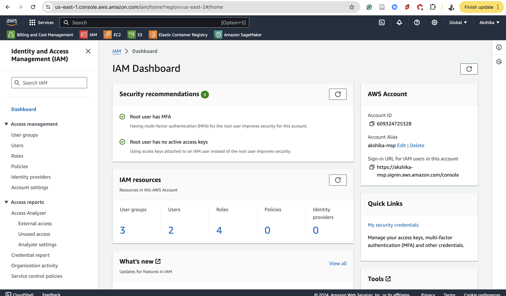
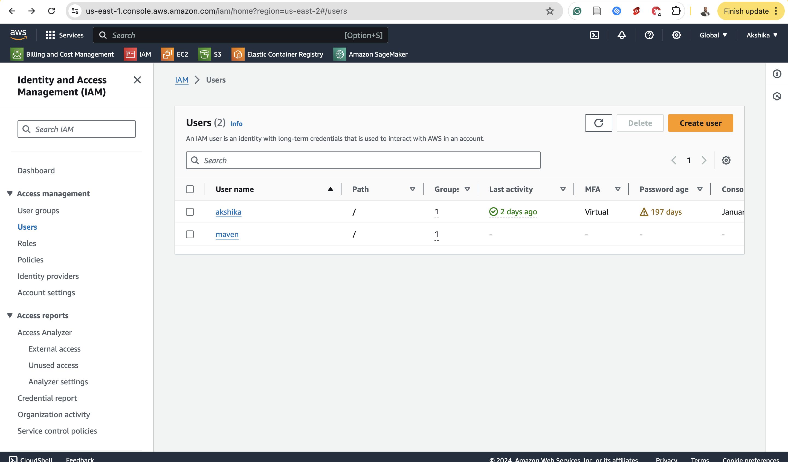
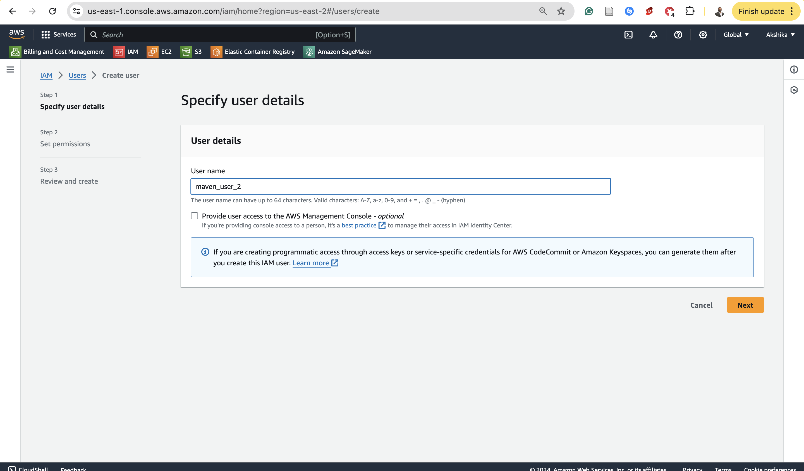
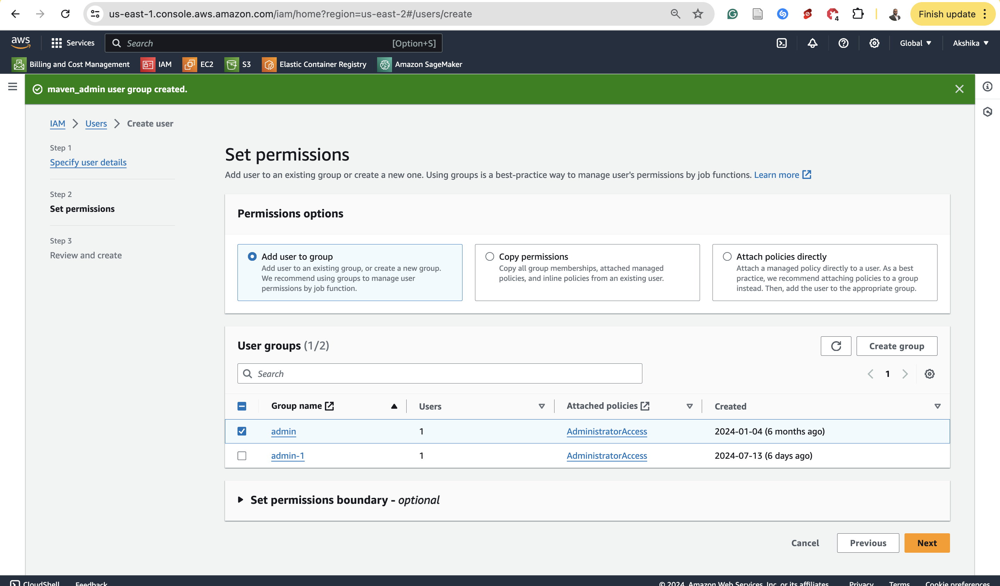
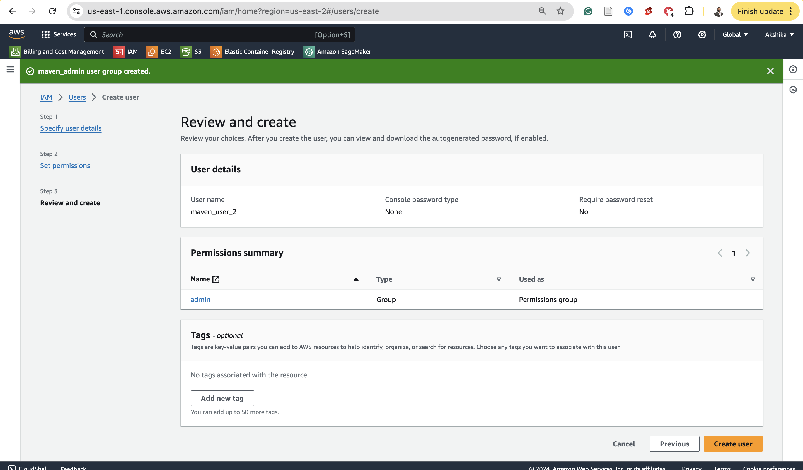
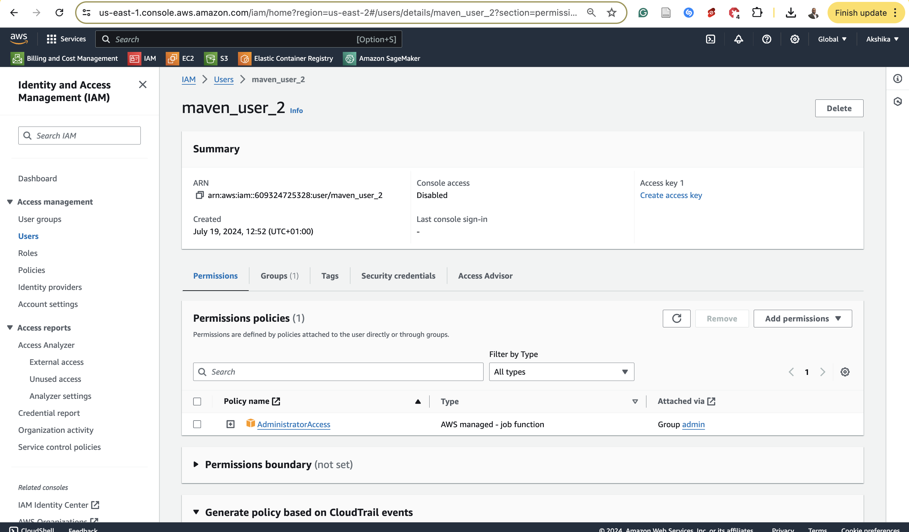
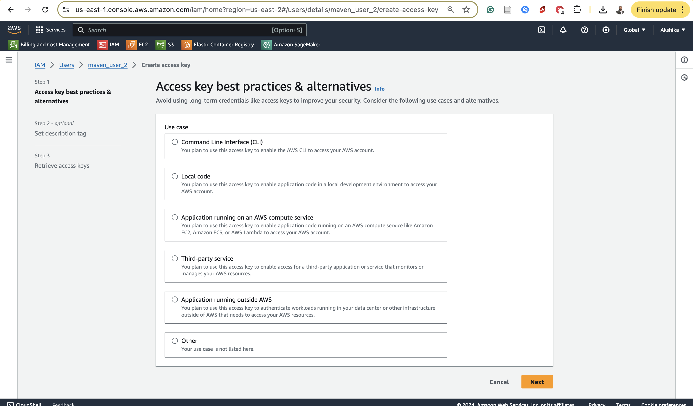

# Productionizing an ML Model

### 1. Initial Setup

1. **Create a GitHub Project:**
   * Create a new repository on GitHub.
   * Clone the repository to your local machine.
2. **Install GitHub Desktop:**
   * Download and install [GitHub Desktop](https://github.com/apps/desktop).
3. **Download and Setup VSCode:**
   * Download and install Visual Studio Code.
   * Open your project folder in VSCode.
   * Set up a virtual environment in VSCode.

### 2. AWS IAM Setup

1. **Create IAM User with Proper Permissions:**
   * Go to the IAM console in AWS.
   * 
   * 
   * Create a new IAM user with programmatic access.
   * Attach policies for Amazon S3, Amazon ECR, and Amazon SageMaker (e.g., `AmazonS3FullAccess`, `AmazonEC2ContainerRegistryFullAccess`, `AmazonSageMakerFullAccess`).

     

     
     
     
  
     
2. **Configure AWS CLI with IAM User Credentials:**
   * Install **[AWS CLI](https://aws.amazon.com/cli/)**.
   * Run `aws configure` and input the IAM user’s access key, secret key, default region, and output format.

```
AWS Access Key ID:
AWS Secret Access Key:
Default region name: us-east-2
Default output format: json
```


### 3. Project Structure

1. **Create Project Files and Folders:**
   * `main.py`: This is your main code that controls the entry into training and inference scripts:
   * `training.py`: Your main training script.
   * `requirements.txt`: List of dependencies.
   * `inference.py`: Your main inference script.
   * `data/`: Directory to store your dataset.
2. **Download Data from Kaggle:**
   * Download the dataset from [Kaggle](https://www.kaggle.com/competitions/titanic/data).
   * Place the dataset in the `data/` folder.
3. **Install Dependencies:**
   * Install the dependencies listed in `requirements.txt` within your virtual environment.
     ```pip install -r requirements.txt```
4. **Run the Training Script:**
   * Ensure `training.py` runs successfully in your environment.

### 4. Dockerization

1. **Install Docker:**
   * Download and install Docker.
2. **Create Dockerfile:**
   * Write a Dockerfile to containerize your application.
3. **Build and Run Docker Image:**
   * Build the Docker image.
   * Run the Docker container and verify the results.

### 5. S3 Integration

1. **Upload Data to S3:**

   * Upload your dataset to an S3 bucket.
   * Ensure your IAM user has `s3:PutObject` and `s3:GetObject` permissions.
2. **Modify Code for S3 Integration:**

   * Update your code to download the data from S3 at runtime using Boto3.

   ```python
   import boto3
   s3 = boto3.client('s3')
   s3.download_file('your-bucket-name', 'your-dataset.csv', 'data/your-dataset.csv')

   ```

### 6. Docker Image on ECR

1. **Setup ECR Repository:**

   * Create a repository on Amazon Elastic Container Registry (ECR).
2. **Push Docker Image to ECR:**

   * Authenticate Docker to your ECR using IAM credentials.
   * Tag and push your Docker image to ECR.

   ```
   aws ecr get-login-password --region your-region | docker login --username AWS --password-stdin your-account-id.dkr.ecr.your-region.amazonaws.com
   docker tag your-image:latest your-account-id.dkr.ecr.your-region.amazonaws.com/your-repo:latest
   docker push your-account-id.dkr.ecr.your-region.amazonaws.com/your-repo:latest

   ```
3. **Download Image from ECR:**

   * Pull the Docker image from ECR and run it locally to verify.

### 7. SageMaker Endpoint Integration

1. **Deploy Model on SageMaker:**
   * Write and deploy your model to a SageMaker endpoint.
2. **Call SageMaker Endpoint Locally:**
   * Write code to call the SageMaker endpoint from your local environment.
3. **Test the End-to-End Pipeline:**
   * Test the entire workflow from local code execution to SageMaker inference.

### 8. GitHub Integration

1. **Push Code to GitHub:**

   * Commit and push your local project to GitHub.
2. **Setup GitHub Actions for CI/CD:**

   * Add a build workflow to automate building and pushing your Docker image to ECR.

   ```yaml
   name: CI/CD

   on: [push]

   jobs:
     build:
       runs-on: ubuntu-latest

       steps:
       - uses: actions/checkout@v2
       - name: Set up Docker Buildx
         uses: docker/setup-buildx-action@v1
       - name: Login to Amazon ECR
         run: |
           aws ecr get-login-password --region ${{ secrets.AWS_REGION }} | docker login --username AWS --password-stdin ${{ secrets.AWS_ACCOUNT_ID }}.dkr.ecr.${{ secrets.AWS_REGION }}.amazonaws.com
       - name: Build and push
         run: |
           docker build -t ${{ secrets.AWS_ACCOUNT_ID }}.dkr.ecr.${{ secrets.AWS_REGION }}.amazonaws.com/your-repo:latest .
           docker push ${{ secrets.AWS_ACCOUNT_ID }}.dkr.ecr.${{ secrets.AWS_REGION }}.amazonaws.com/your-repo:latest

   ```
   

3. **Execute the Build Locally:**

   * Run the build workflow locally to ensure it works as expected.
